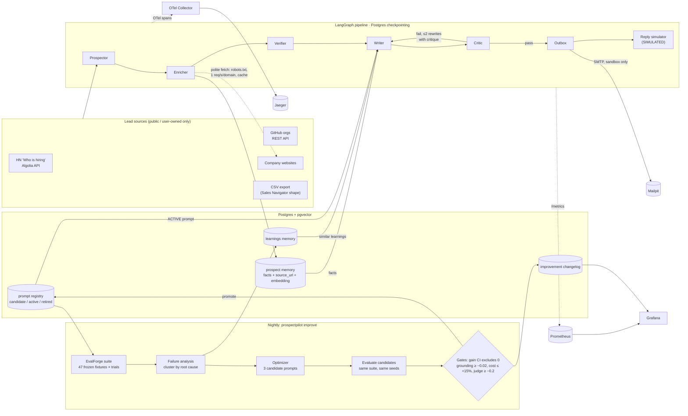
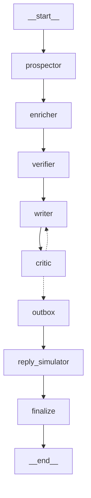

# ProspectPilot

**A self-improving SDR agent.** Give it an Ideal Customer Profile; it finds companies from
public sources, researches them, verifies contact emails without probing mail servers, and writes
3-step outreach sequences in which **every personalized claim cites a stored fact with a source
URL**. Every night it evaluates its own drafts with [EvalForge](https://github.com/AbhilashSomigari/evalforge),
mines the failures into a learnings memory, proposes better writer prompts, and promotes one
**only if it passes regression gates**.

[](.github/workflows/ci.yml)
· Python 3.12 · LangGraph · FastAPI · Postgres + pgvector · OpenTelemetry · Prometheus/Grafana ·
EvalForge · Terraform (AWS ECS Fargate)

Measured results (real model runs, with the exact commands): **[RESULTS.md](RESULTS.md)**.

---

## Quickstart (no API keys)

```bash
git clone https://github.com/AbhilashSomigari/prospectpilot && cd prospectpilot
make up      # postgres+pgvector, mailpit, jaeger, otel-collector, prometheus, grafana, api, worker
make demo    # full campaign over fictional fixture companies, deterministic mock LLM
```

Then open: emails in **Mailpit** <http://localhost:8025> · the run's trace in **Jaeger**
<http://localhost:16686> (the demo prints the direct link) · dashboards in **Grafana**
<http://localhost:3000> · API docs <http://localhost:8000/docs>.

With a real model: `ollama pull qwen2.5 && LLM_PROVIDER=ollama uv run prospectpilot demo --inline`,
or put `ANTHROPIC_API_KEY` in `.env` (writer/optimizer: `claude-sonnet-5-5`; critic, extraction,
reply simulator: `claude-haiku-4-5-20251001`).

---

## Architecture



The compiled LangGraph (from `prospectpilot graph mermaid`):



| Agent | What it does | Where |
|---|---|---|
| **Prospector** | Gathers candidates from HN "Who is hiring" (Algolia API), GitHub orgs, public sites and CSV; scores against the ICP (keywords, stack, hiring signals, location, team size); dedupes by domain. | `agents/prospector.py`, `sources/` |
| **Enricher** | Fetches homepage/about/careers/blog (+ latest posts); LLM-extracts facts (product, dated news, stack, open roles, team size, funding), each with its `source_url`; drops any fact whose URL wasn't fetched or whose text isn't supported by that page; embeds and stores. | `agents/enricher.py` |
| **Verifier** | Syntax, MX lookup (dnspython; null MX / implicit MX), disposable domains, role addresses, pattern inference from known addresses at the domain → confidence 0–1 with reasons. **No SMTP RCPT probing**; catch-all is always `unknown`. | `verify/` |
| **Writer** | 3 emails ≤120 words, ≥2 distinct facts cited as `[fact:id]` (stripped before sending), conditioned on the most similar learnings. Pydantic-validated JSON. | `agents/writer.py` |
| **Critic** | Deterministic checks (length, spam phrases, placeholders, marker coverage, ids belong to this prospect, every marked sentence restates its fact, no numbers absent from the cited fact, unmarked company-specific claims) then an LLM-judge rubric (personalization, relevance, clarity, tone). Fail → rewrite with the critique, max 2 rounds. | `agents/critic.py` |
| **Outbox** | Sends step 1 to Mailpit, schedules follow-ups (+3d, +7d), cancels them on a reply, stores message ids. | `agents/outbox.py`, `agents/mailer.py` |
| **Reply simulator** | An LLM plays the prospect persona (built only from stored facts) → reply / objection / no-reply + probability. Every row is `simulated=true` and labeled **SIMULATED** in the API and RESULTS. | `agents/reply_sim.py` |

## The self-improving loop

`prospectpilot improve` (also `POST /improve`, the worker, and a nightly EventBridge Scheduler task):

1. **Evaluate ACTIVE** on the EvalForge suite: one task per frozen fixture (47 fictional companies
   whose facts were extracted once by the real Enricher and frozen, so runs are reproducible
   offline), N trials per task, per-trial seeds shared by every variant.
2. **Failure analysis**: failing trials are clustered by their primary failed check
   (`ungrounded_claims`, `missing_fact_markers`, `word_limit`, …); an LLM names the root cause of
   each cluster and writes an actionable learning into **learnings memory** — which the Writer
   retrieves by similarity in production.
3. **Optimizer**: proposes 3 candidates (`targeted`, `checklist`, `exemplar`). It proposes
   *guidance edits*, and code composes the candidate prompt, so even a small local model cannot
   break the output contract.
4. **Evaluate candidates** on the same suite, same seeds, same learnings snapshot.
5. **Promote** the best candidate only if it beats ACTIVE on the primary metric
   (grounded-and-passing rate = EvalForge `task_success`) **with a paired bootstrap 95% CI of the
   gain that excludes 0** (trials paired by fixture and seed, resampled by fixture), **and** passes
   the regression gates: grounded-claim rate ≥ ACTIVE − 0.02, cost ≤ +15% (token cost proxy for
   unpriced local models), judge mean ≥ ACTIVE − 0.2. The significance gate was added after the
   first three real rounds promoted +1 to +3 of 80 trial gains that were within noise — see
   [RESULTS.md](RESULTS.md).
6. **Changelog**: round, prompt diff, metrics before/after, gate results, decision →
   `improvement_rounds` table, Grafana panel, and raw EvalForge run artifacts in `evals/runs/`.

### Graders (EvalForge)

| Grader | Source | Passes when |
|---|---|---|
| `json_contract` | EvalForge built-in | output is a JSON object with `emails` |
| `cites_known_fact` | EvalForge `citation_groundedness` | at least one of this prospect's fact ids is cited |
| `sequence_checks` | ProspectPilot | every deterministic critic check passes (recomputed from the output) |
| `hallucination_grounding` | ProspectPilot | every personalized claim is grounded (feeds EvalForge's `hallucination_rate`) |
| `judge_rubric` | ProspectPilot | judge mean ≥ 3.5 / 5 |

`make eval PROVIDER=ollama` runs the suite and exits 2 when a gate fails (EvalForge's CI
convention). `evals/suite_builtin.yaml` lets plain EvalForge drive the same agent through its
command adapter:
`evalforge run --suite evals/suite_builtin.yaml --agent "python -m prospectpilot.evals.agent --prompt-file src/prospectpilot/prompts/writer_v1.md"`.

EvalForge gaps implemented locally (candidate upstream PRs): grader plugins (we register into its
registry in-process), a provider-agnostic judge grader, relative (%) regression gates, gates on
per-grader means, and passing the trial index to adapters (needed for per-trial seeds).

## Guardrails

- **Sources**: no LinkedIn or any ToS-restricted scraping. robots.txt enforced for every host,
  1 request/second per domain, descriptive User-Agent, on-disk cache.
- **Sending**: a hard-coded guard (`agents/mailer.py`) refuses any SMTP host except the Mailpit
  sandbox unless `ALLOW_REAL_SEND=true` **and** the CLI's `--i-understand` flag are both set; it is
  re-checked at send time. Even the AWS deployment runs Mailpit as a sidecar.
- **Verification**: no SMTP probing of third-party mail servers.
- **Grounding**: facts are validated against the fetched page at extraction time; the critic and
  the eval graders fail any personalized claim that isn't supported by a cited fact.
- **Honesty**: simulated replies are labeled SIMULATED everywhere; mock-provider numbers are never
  reported as results; RESULTS.md is generated from the database by `scripts/make_results.py`.
- **Data**: fixtures are fictional companies on the reserved `.test` TLD — no real person's data in
  the repo. Secrets only via `.env` (gitignored) / AWS Secrets Manager.

## Observability

- **Traces**: one trace per campaign run — spans for every graph node, tool (`http_fetch`,
  `dns_mx`, `smtp_send`, `embed`, `collect_pages`) and LLM call with `gen_ai.*` token attributes,
  `pp.cost_usd` and latency. The trace id is stored on the run (`GET /runs/{id}` returns a Jaeger
  link); API responses carry `X-Trace-Id`; worker logs include `trace=`. Set
  `LANGFUSE_ENABLED=true` to also export to Langfuse (OTLP).
- **Metrics** (`/metrics`): LLM calls/tokens/cost/latency by model and purpose, node duration,
  tool calls, leads by outcome, lead latency and cost, critic verdicts per draft round, emails.
- **Grafana** (provisioned, `scripts/build_dashboard.py`): per-round quality / cost per lead /
  latency from the changelog table, the changelog itself, and pipeline panels from Prometheus.

## API and CLI

| API | CLI |
|---|---|
| `POST /campaigns` (ICP JSON) | `prospectpilot campaign create icp.yaml` |
| `GET /campaigns/{id}` | `prospectpilot campaign show ID` |
| `POST /campaigns/{id}/run` (queued for the worker; `?inline=true`) | `prospectpilot run ID [--inline] [--offline] [--i-understand]` |
| `GET /runs/{id}` — status, per-node timings, stats, trace id | `prospectpilot run-show ID` |
| `GET /prospects/{id}` — facts, verification, drafts + critiques, outbox, replies | `prospectpilot prospect ID` |
| `POST /improve` (queued for the worker) | `prospectpilot improve [--trials 2] [--limit N]` |
| `GET /improvements` | `prospectpilot improvements` |
| `GET /metrics`, `GET /healthz` | `prospectpilot eval`, `prospectpilot demo`, `prospectpilot outbox flush` |

Set `API_KEY` to require `Authorization: Bearer <key>`. An ICP looks like
[`examples/demo_icp.yaml`](examples/demo_icp.yaml).

## Configuration

| Provider | `LLM_PROVIDER` | Notes |
|---|---|---|
| Anthropic (default) | `anthropic` | `ANTHROPIC_API_KEY`; structured outputs via `output_config.format`; no `temperature` on Sonnet 5.5 (effort instead); per-call USD from the pricing table in `config.py` |
| OpenAI-compatible | `openai` | `OPENAI_BASE_URL`, `OPENAI_API_KEY`, `OPENAI_LARGE_MODEL`, `OPENAI_SMALL_MODEL` |
| Ollama | `ollama` | free local mode (`qwen2.5`); JSON-schema constrained decoding |
| Mock | `mock` | deterministic, no model — demo/CI plumbing only, never a quality signal |

Embeddings: `EMBEDDING_PROVIDER=hash` (deterministic, offline; default), `ollama`
(`nomic-embed-text`) or `openai` — all 768-d. See [`.env.example`](.env.example).

## Deploying to AWS

Terraform in [`infra/terraform`](infra/terraform) (ECS Fargate api + worker behind an ALB, RDS
Postgres 16 with pgvector, ECR, Secrets Manager, CloudWatch logs, EventBridge Scheduler for the
nightly improve task). It passes `terraform validate`; it has not been applied. Steps:
[`docs/deploy-aws.md`](docs/deploy-aws.md).

## Development

```bash
make install      # uv sync + git hooks (pre-commit: ruff + unit tests)
make check        # ruff, mypy --strict, unit tests (no network, no docker)
make test-int     # integration + e2e against the compose stack (uses a separate *_test DB)
make eval PROVIDER=ollama      # EvalForge suite; exit 2 on a failing gate
make improve PROVIDER=ollama   # one self-improvement round
make results      # regenerate RESULTS.md from the database
make tf-validate
```

Demo GIF: install [vhs](https://github.com/charmbracelet/vhs), run `make up`, then
`vhs docs/demo.tape` (records `make demo` + the trace link into `docs/demo.gif`).

```
src/prospectpilot/
  agents/    prospector, enricher, verifier pieces, writer, critic, drafting loop, outbox, mailer, reply_sim
  graph/     LangGraph state, nodes, wiring, runner (Postgres checkpointing)
  memory/    SQLAlchemy schema, repositories, learnings (pgvector), prompt registry
  llm/       provider router + Anthropic / OpenAI-compatible / Ollama / mock backends, embeddings
  sources/   polite fetcher, HN, GitHub, websites, CSV
  verify/    syntax, MX, lists, patterns, scorer
  evals/     EvalForge adapter, graders, suite, improvement loop
  api/ cli/ obs/   FastAPI, Typer, OpenTelemetry + Prometheus
evals/       frozen fixtures (sites, facts), suite YAML, raw run artifacts per round
infra/terraform/  docker/  scripts/  tests/
```

## License

[MIT](LICENSE)
